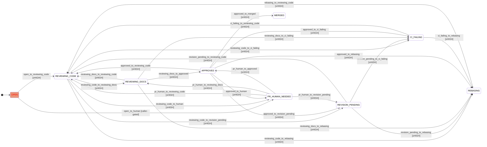

# Auto-improve lifecycle FSM

> Auto-generated by `scripts/generate-fsm-docs.py` from
> `cai_lib/fsm.py` (re-export of fsm_states, fsm_transitions, fsm_confidence).
> Do not edit this file by hand — edit the FSM definition and the CI
> workflow will regenerate it.

## Issue state machine

```mermaid
stateDiagram-v2
  direction LR
  classDef s_default fill:white,color:black
  classDef s_inactive fill:white,color:black
  classDef s_parallel color:black,fill:white
  classDef s_active color:red,fill:darksalmon
  classDef s_previous color:blue,fill:azure
  
  state "RAISED" as RAISED
  Class RAISED s_active
  state "REFINING" as REFINING
  Class REFINING s_default
  state "HUMAN_NEEDED" as HUMAN_NEEDED
  Class HUMAN_NEEDED s_default
  state "TRIAGING" as TRIAGING
  Class TRIAGING s_default
  state "PLAN_APPROVED" as PLAN_APPROVED
  Class PLAN_APPROVED s_default
  state "APPLYING" as APPLYING
  Class APPLYING s_default
  state "APPLIED" as APPLIED
  Class APPLIED s_default
  state "SOLVED" as SOLVED
  Class SOLVED s_default
  state "REFINED" as REFINED
  Class REFINED s_default
  state "NEEDS_EXPLORATION" as NEEDS_EXPLORATION
  Class NEEDS_EXPLORATION s_default
  state "PLANNING" as PLANNING
  Class PLANNING s_default
  state "PLANNED" as PLANNED
  Class PLANNED s_default
  state "IN_PROGRESS" as IN_PROGRESS
  Class IN_PROGRESS s_default
  state "PR" as PR
  Class PR s_default
  state "MERGED" as MERGED
  Class MERGED s_default
  
  RAISED --> REFINING: raise_to_refining [≥HIGH]
  RAISED --> HUMAN_NEEDED: raise_to_human [≥HIGH]
  RAISED --> TRIAGING: raise_to_triaging [≥HIGH]
  TRIAGING --> REFINING: triaging_to_refining [≥HIGH]
  TRIAGING --> HUMAN_NEEDED: triaging_to_human [≥HIGH]
  TRIAGING --> PLAN_APPROVED: triaging_to_plan_approved [caller-gated]
  TRIAGING --> APPLYING: triaging_to_applying [caller-gated]
  APPLYING --> APPLIED: applying_to_applied [≥HIGH] | applying_to_applied_inferred_ops [≥MEDIUM]
  APPLYING --> HUMAN_NEEDED: applying_to_human [≥HIGH]
  APPLIED --> SOLVED: applied_to_solved [≥HIGH]
  REFINING --> REFINED: refining_to_refined [≥HIGH]
  REFINING --> NEEDS_EXPLORATION: refining_to_exploration [≥HIGH]
  REFINING --> HUMAN_NEEDED: refining_to_human [≥HIGH]
  NEEDS_EXPLORATION --> REFINING: exploration_to_refining [≥HIGH]
  REFINED --> PLANNING: refined_to_planning [≥HIGH]
  PLANNING --> PLANNED: planning_to_planned [≥HIGH]
  PLANNING --> HUMAN_NEEDED: planning_to_human [≥HIGH]
  PLANNED --> PLAN_APPROVED: planned_to_plan_approved [≥HIGH] | planned_to_plan_approved_mitigated [≥MEDIUM] | planned_to_plan_approved_docs_only [≥MEDIUM] | planned_to_plan_approved_approvable [≥MEDIUM]
  PLANNED --> HUMAN_NEEDED: planned_to_human [≥HIGH]
  PLAN_APPROVED --> IN_PROGRESS: approved_to_in_progress [≥HIGH]
  IN_PROGRESS --> PR: in_progress_to_pr [≥HIGH]
  IN_PROGRESS --> REFINING: in_progress_to_refining [caller-gated]
  PR --> MERGED: pr_to_merged [≥HIGH]
  PR --> REFINED: pr_to_refined [≥HIGH]
  PR --> PLAN_APPROVED: pr_to_plan_approved [caller-gated]
  PR --> HUMAN_NEEDED: pr_to_human_needed [≥HIGH]
  MERGED --> SOLVED: merged_to_solved [≥HIGH]
  HUMAN_NEEDED --> RAISED: human_to_raised [≥HIGH]
  HUMAN_NEEDED --> REFINING: human_to_refining [≥HIGH]
  HUMAN_NEEDED --> PLAN_APPROVED: human_to_plan_approved [≥HIGH]
  HUMAN_NEEDED --> NEEDS_EXPLORATION: human_to_exploration [≥HIGH]
  HUMAN_NEEDED --> SOLVED: human_to_solved [≥HIGH]
  [*] --> RAISED
```

## PR state machine

