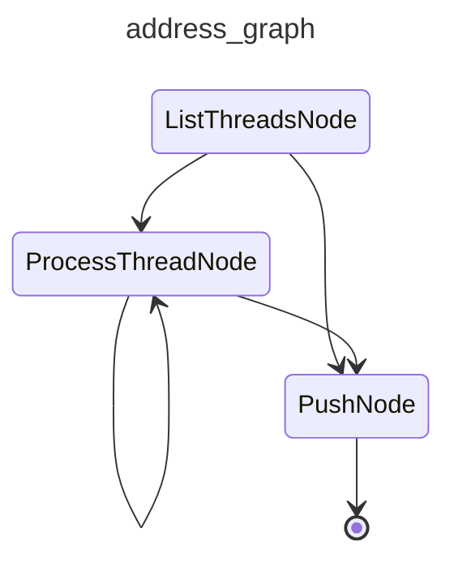

# cai-address

Walks each unresolved review thread on a pull request and either commits a fix or replies with reasoning.

## Graph

<!-- AUTO-GENERATED by scripts/gen_workflow_graphs.py — do not edit. -->

