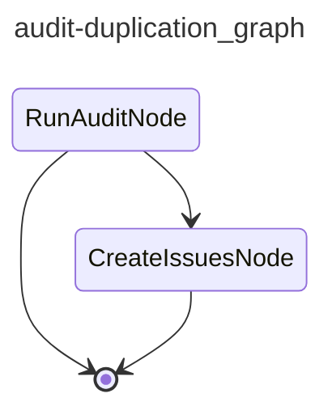

# CAI Audit Duplication

Runs a duplication audit via jscpd on every 30th commit to main, or on manual dispatch. Files findings as GitHub issues.

## Graph

<!-- AUTO-GENERATED by scripts/gen_workflow_graphs.py — do not edit. -->

