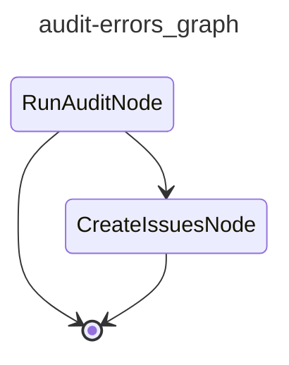

# CAI Audit Errors

Triggered when an issue is labeled ``cai:failed``. Audits the most recent error traces and files findings as GitHub issues.

## Graph

<!-- AUTO-GENERATED by scripts/gen_workflow_graphs.py — do not edit. -->

