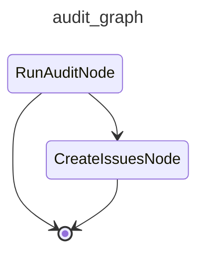

# CAI Audit

Runs an audit agent against Langfuse traces or a cloned repository, then files proposed improvements as GitHub issues.

## Modes

| Mode | Description |
|---|---|
| `cost` | Audits the most costly session of the last 10 issue-solving runs. |
| `errors` | Audits the 10 most recent traces that contain error-level observations. |
| `duplication` | Clones the repo, runs jscpd, and audits copy-paste findings. |
| `architecture` | Clones the repo and audits structural health. |
| `security` | Clones the repo and audits for common vulnerability patterns (hardcoded secrets, unsafe subprocess, injection vectors, insecure deserialization, etc.). |
| `tools` | Analyses per-agent tool usage against declared tools across recent traces. |

## Graph

<!-- AUTO-GENERATED by scripts/gen_workflow_graphs.py — do not edit. -->

