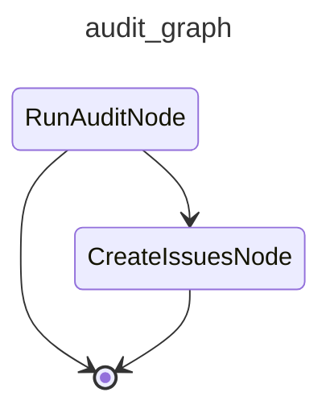

# cai-audit

Runs the audit agent in one of four modes — cost, errors, duplication, or architecture — and files proposed improvements as GitHub issues. Use ``--mode architecture`` to clone the target repo and audit its structure for refactoring opportunities.

## Modes

| Mode | Description |
|---|---|
| `cost` | Audits the most costly session of the last 10 issue-solving runs. |
| `errors` | Audits the 10 most recent traces that contain error-level observations. |
| `duplication` | Clones the repo, runs jscpd, and audits copy-paste findings. |
| `architecture` | Clones the repo and audits structural health using a set of lenses (see below). |
| `security` | Clones the repo and audits for common vulnerability patterns (hardcoded secrets, unsafe APIs, misconfigurations). |

## Architecture mode lenses

The architecture auditor examines the repository through the following lenses and proposes GitHub issues for each finding above its confidence threshold:

| Lens | What is flagged |
|---|---|
| **Module organisation** | Files placed in directories where they don't belong (e.g. utility code under a test tree). |
| **Documentation coverage** | Agent definition files without corresponding documentation pages; empty doc stubs. |
| **Interface consistency** | Parallel code paths that solve the same problem through different abstractions. |
| **Module size** | Files significantly over 300 lines should be split into smaller, single-purpose modules — even when they have a single concern, large files become hard to navigate, review, and test as they grow. Files marked `!LARGE!` in the audit context are already highlighted for this lens. |
| **Dead code** | Utility scripts or modules that are never imported, invoked, or referenced. |
| **Configuration duplication** | Exclusion lists, permission rules, or thresholds repeated across multiple config files. |

## Graph

<!-- AUTO-GENERATED by scripts/gen_workflow_graphs.py — do not edit. -->

