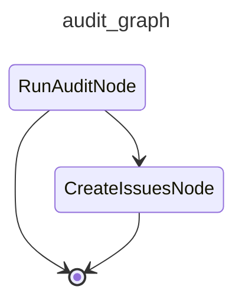

# cai-audit

Runs the audit agent against recent Langfuse traces and files proposed improvements as GitHub issues.

## Graph

<!-- AUTO-GENERATED by scripts/gen_workflow_graphs.py — do not edit. -->

