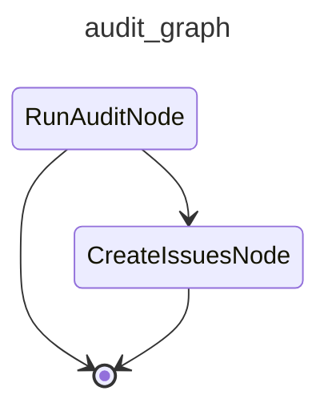

# cai-audit

Runs the audit agent in one of four modes — cost, errors, duplication, or architecture — and files proposed improvements as GitHub issues. Use ``--mode architecture`` to clone the target repo and audit its structure for refactoring opportunities.

## Modes

| Mode | Description |
|---|---|
| `cost` | Audits the most costly session of the last 10 issue-solving runs. |
| `errors` | Audits the 10 most recent traces that contain error-level observations. |
| `duplication` | Clones the repo, runs jscpd, and audits copy-paste findings. |
| `architecture` | Clones the repo and audits structural health. |
| `security` | Clones the repo and audits for common vulnerability patterns (hardcoded secrets, unsafe APIs, misconfigurations). |

## Graph

<!-- AUTO-GENERATED by scripts/gen_workflow_graphs.py — do not edit. -->

