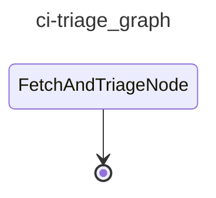

# cai-ci-triage

Triggered when the CI workflow completes. Fetches failed job logs, triages the root cause with an LLM agent, and files a cai:raised issue with findings.

## Graph

<!-- AUTO-GENERATED by scripts/gen_workflow_graphs.py — do not edit. -->

