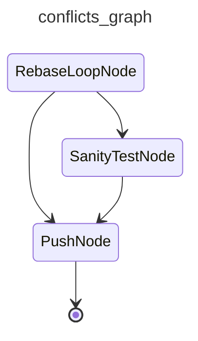

# cai-resolve-conflicts

Rebases a pull request onto its base branch, asking the resolve_step agent to clear conflict markers commit-by-commit. Runs a sanity test pass after a non-trivial rebase before force-pushing the rewritten head.

## Graph

<!-- AUTO-GENERATED by scripts/gen_workflow_graphs.py — do not edit. -->

