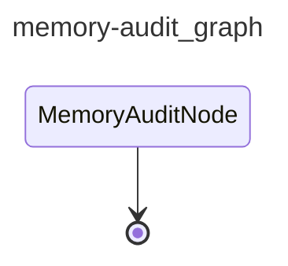

# cai-memory-audit

Scans `.cai/memory/` entries, verifies their claims against the current codebase, and marks stale or superseded entries by updating their YAML frontmatter status fields.

## Graph

<!-- AUTO-GENERATED by scripts/gen_workflow_graphs.py — do not edit. -->

