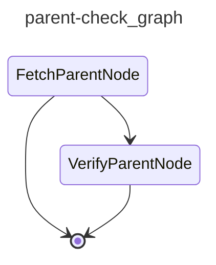

# CAI Parent Check

Triggered when a sub-issue labeled ``cai:sub-issue`` is closed. Checks whether all sibling sub-issues of the parent are also closed and, if so, files a summary finding on the parent issue.

## Graph

<!-- AUTO-GENERATED by scripts/gen_workflow_graphs.py — do not edit. -->

