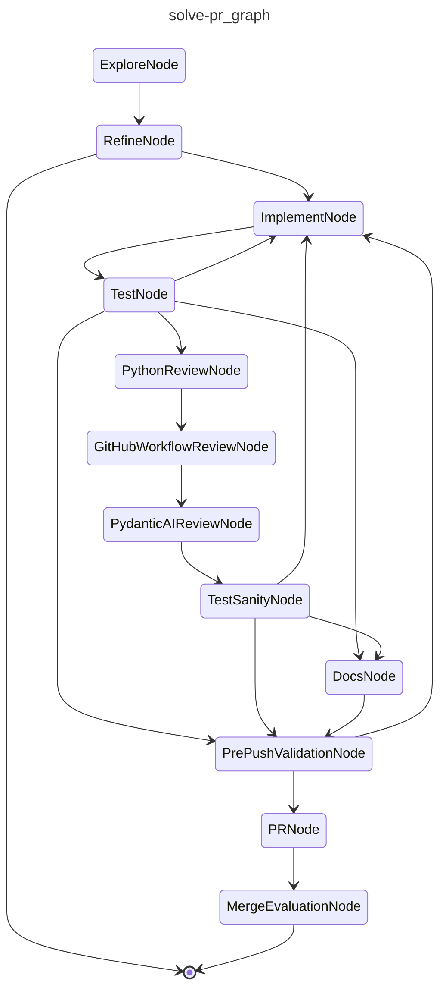

# CAI Solve (PR review)

Responds to 'changes requested' pull request reviews by implementing the requested fixes and pushing them in place.

## Graph

<!-- AUTO-GENERATED by scripts/gen_workflow_graphs.py — do not edit. -->

