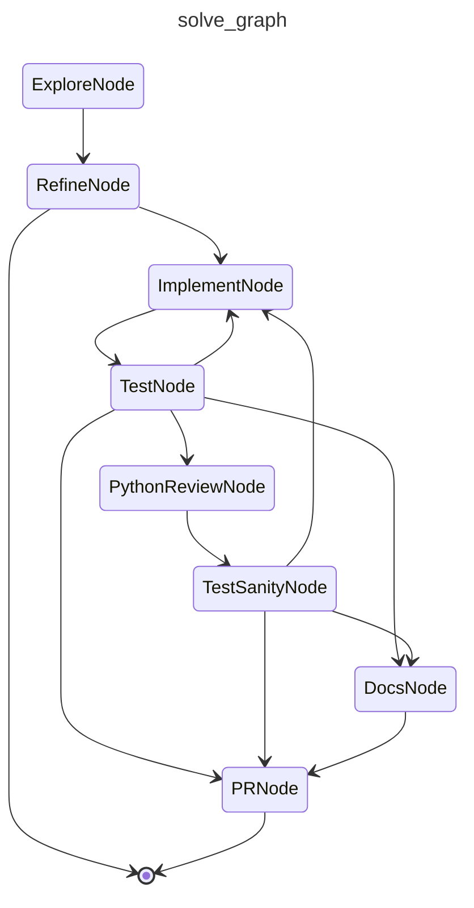

# cai-solve

Pulls a GitHub issue, refines it, implements the fix, runs checks, and opens a pull request.

## Graph

<!-- AUTO-GENERATED by scripts/gen_workflow_graphs.py — do not edit. -->

```mermaid
---
title: solve_graph
---
stateDiagram-v2
  ExploreNode --> RefineNode
  RefineNode --> ImplementNode
  RefineNode --> [*]
  ImplementNode --> TestNode
  TestNode --> PythonReviewNode
  TestNode --> DocsNode
  TestNode --> PRNode
  TestNode --> ImplementNode
  PythonReviewNode --> TestSanityNode
  TestSanityNode --> DocsNode
  TestSanityNode --> PRNode
  TestSanityNode --> ImplementNode
  DocsNode --> PRNode
  PRNode --> [*]
```
