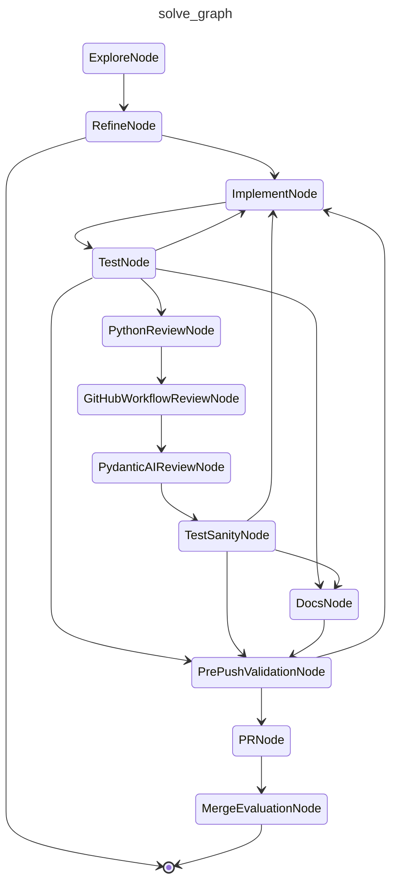

# CAI Solve

Drives a GitHub issue or pull request through the same graph. Issues are explored, refined, implemented, and pushed as a new PR. PRs enter at the implement step with their unresolved review threads in the prompt, and the bundled fix is pushed in place.

## Graph

<!-- AUTO-GENERATED by scripts/gen_workflow_graphs.py — do not edit. -->

