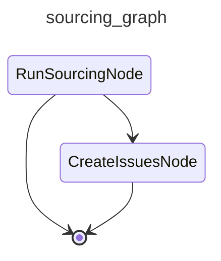

# CAI Sourcing

Monthly scan of the open-source ecosystem for transferable tools, libraries, and frameworks. Surfaces findings as triageable GitHub issues.

## Graph

<!-- AUTO-GENERATED by scripts/gen_workflow_graphs.py — do not edit. -->

