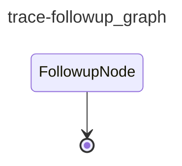

# CAI Trace Follow-up

Daily check on every open ``cai:trace-investigation`` issue. Pulls yesterday's Langfuse traces, scopes them via the ``Trace filter`` hint persisted in each issue body, delegates per-trace deep dives to ``trace_analyst``, and posts a ``Last reproduced`` comment when the symptom appears again.

## Graph

<!-- AUTO-GENERATED by scripts/gen_workflow_graphs.py — do not edit. -->

